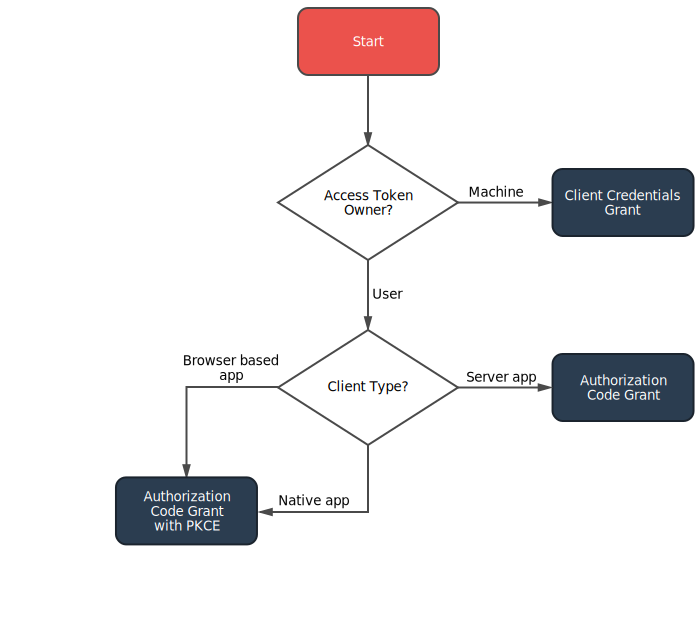

# Laravel Passport integration.

## Which Grant?



### Authorization Code Flow

If the client is a web application that has runs entirely on the front end (e.g. a single page web application) or a native application such as a mobile app **you should implement the authorization code grant with the PKCE extension**.

### Password Grant

We strongly recommend that you use the Authorization Code flow over the Password grant for several reasons.  

The Authorization Code Grant redirects to the authorization server. This provides the authorization server with the opportunity to prompt the user for multi-factor authentication options, take advantage of single-sign-on sessions, or use third-party identity providers.  

The Password grant does not provide any built-in mechanism for these and **must be extended with custom code**.  
 
 * [Which OAuth 2.0 grant should I implement?](https://oauth2.thephpleague.com/authorization-server/which-grant/)

_In my opinion, for the first-part mobile and SPA applications, when multi-factor authorization is not required, a user-friendly solution is to use the Password Grant with a proxy server. The user credentials are sent to the proxy server, and the proxy server appends the client secret to them. The received response from the authorization server is sent back to the client. This saves the user from redirects and at the same time ensures the safe storage of client secret. Moreover, this allows the authorization server to accept requests only from certain IP addresses._

## Dependencies

 * [it-aces/laravel-doctrine](https://bitbucket.org/vitaliy_kovalenko/laravel-doctrine/src/master/)

## Install

* Add composer repository

```BASH
"repositories": [
	{
       "type": "vcs",
       "url": "git@bitbucket.org:vitaliy_kovalenko/laravel-doctrine.git"
    },
    {
       "type": "vcs",
       "url": "git@bitbucket.org:vitaliy_kovalenko/laravel-doctrine-oauth.git"
    }
]
```

* Install packages

```BASH
composer require it-aces/laravel-doctrine-oauth
```

## Setting up

 * php artisan passport:client --password
 * config/auth.php
 
```PHP
'api' => [
    'driver' => 'passport',
    'provider' => 'users',
],
```


